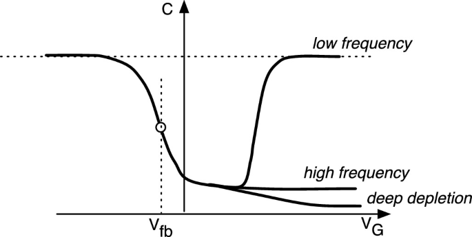

## Procedure

  
**Fig. 1. MOS C/V curve**

  

1.  **Set Material Parameters:**
    *   Choose the semiconductor material (Si, Ge, GaAs) for the simulation by clicking on the respective button.
    *   Enter the work function of the metal gate, _ϕm_, in electron volts (eV).
    *   Input the electron affinity of the semiconductor, _χs_, in eV.
2.  **Define Oxide Properties:**
    *   Enter the oxide thickness, _tox_, in nanometers (nm).
    *   Specify the relative permittivity of the oxide, _εox_.
3.  **Set Semiconductor Parameters:**
    *   Specify the relative permittivity of the semiconductor, _εsemi_.
    *   Enter the effective density of states in the conduction band, _Nc_, and in the valence band, _Nv_, in 1/cm3.
    *   Set the temperature, _T_, in Kelvin (K).
    *   Input the acceptor doping concentration, _NA_, in 1/cm3.
4.  **Calculate Energy Bandgap:**
    *   Use the given formula to calculate the energy bandgap, _Eg_, based on the temperature.
5.  **Submit the Parameters:**
    *   Click the "Submit" button to apply the parameters and perform the simulation.
6.  **Analyze the Results:**
    *   Observe the _Q-V_ (Charge-Voltage) and _C-V_ (Capacitance-Voltage) plots generated from the simulation.
    *   Examine key parameters displayed, such as oxide capacitance (_Cox_), threshold voltage (_VT_), flat-band voltage (_Vfb_), and others.
    *   Interpret the different regions in the C-V curve: accumulation, depletion, and inversion, to understand the behavior of the PMOS capacitor.
