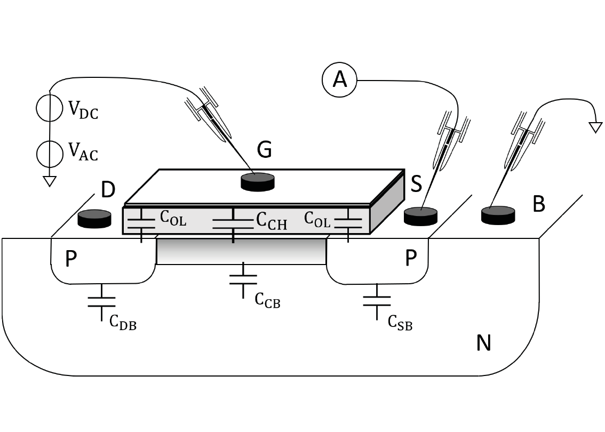

## Theory
**Introduction:**  
Capacitance-Voltage measurements are an important tool to characterize the gate oxide in detail. They provide information about dopant concentration profile, input and output capacitance of the transistor, gate oxide thickness, dopant density, flat-band voltage, gate oxide quality, and interface charge.

 
<strong>Fig. 1. Capacitance-Voltage measurements setup</strong>

  

Capacitance-Voltage (C-V) characterization is a fundamental technique used to study the electrical properties of Metal-Oxide-Semiconductor (MOS) capacitors, including PMOS capacitors. In a PMOS capacitor, the semiconductor substrate is typically a p-type material, which results in distinct capacitance behavior compared to NMOS capacitors due to the different type of charge carriers involved.

The structure of a PMOS capacitor consists of a metal gate, a thin insulating oxide layer, and a p-type semiconductor substrate. When a voltage is applied across the gate, the capacitance of the device varies depending on the electric field's effect on the charge distribution within the substrate. The C-V characteristics of a PMOS capacitor are influenced by the formation of three main operating regions: accumulation, depletion, and inversion.

### Accumulation

In the accumulation region, a negative voltage is applied to the gate, attracting majority carriers (holes) towards the semiconductor-oxide interface. This increases the capacitance since a high concentration of mobile charge carriers is present near the interface, resulting in a capacitance value close to the oxide capacitance.
     
 
